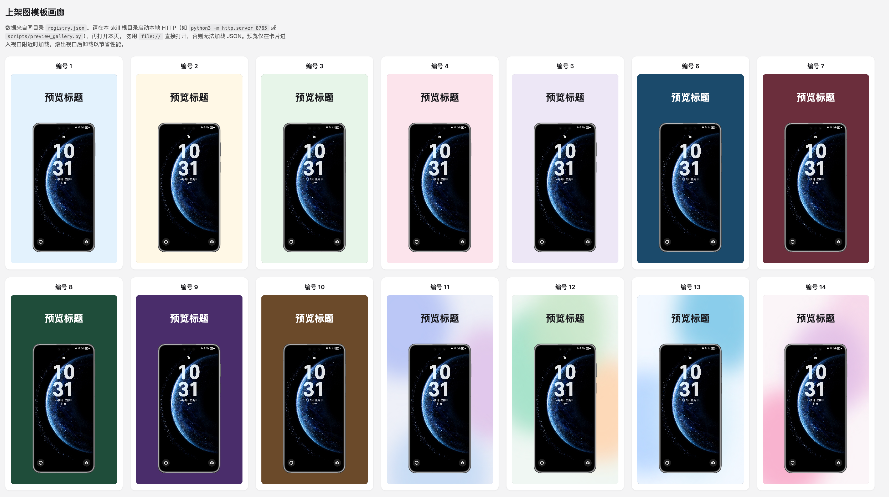

# resize-posts-1080x1920

将目录内图片批量统一为 **1080×1920** 竖版（9:16），或基于 **HTML 模板** 用浏览器渲染并截图出同尺寸海报。可作为 [Claude Skill](SKILL.md) 使用，也可在本地直接运行脚本。

## 功能概览

| 能力 | 说明 |
|------|------|
| **批量缩放** | 等比放大填满画布（cover），水平居中、**顶对齐**（保上方内容，底部可裁）；仅处理**输入目录下一层**文件，不递归子目录。 |
| **格式** | 支持 `png` / `jpg` / `jpeg` / `webp` / `bmp`；带透明通道会先铺白再输出 JPEG。 |
| **模板出图（实验性）** | Playwright + Chromium 加载 `templates/` 下 HTML，注入图片与标题等参数，截图输出 1080×1920。含纯色、渐变、color4bg、**双屏连贯倾斜机框**（`61`/`62` 或 `--pair`）等预设（编号见 `templates/registry.json`）。 |

## 模板画廊预览

本地用 `python3 scripts/preview_gallery.py`（或 `python3 -m http.server`）起服务后打开 **`templates/gallery.html`**，即可在 **上架图模板画廊** 中按编号浏览各预设（数据来自 `templates/registry.json`，勿用 `file://` 直接打开）。下图为画廊界面截图，展示不同背景与机框组合效果：



## 环境要求

- Python **≥ 3.10**
- **仅批量缩放**：安装 [Pillow](https://python-pillow.org/) 即可（`pip install pillow` 或在项目根目录 `uv sync`）。
- **模板渲染**：还需 Playwright 与 Chromium；请先在本目录执行 `scripts/ensure_render_deps.py`（检测后再装，避免重复安装）。详见 [SKILL.md](SKILL.md#依赖安装)。

## 快速开始

克隆或进入本仓库根目录（与 `pyproject.toml` 同级），将 `<IN>` 换成你的图片目录：

```bash
# 批量缩放（默认输出到 <IN>/out_1080x1920）
python3 scripts/resize_posts_1080x1920.py -i <IN>

# 指定输出目录
python3 scripts/resize_posts_1080x1920.py -i <IN> -o <OUT_DIR>
```

使用 **uv** 时可将 `python3` 换成 `uv run python`，以使用锁定依赖。

模板渲染示例（首次请先跑 `ensure_render_deps.py`）：

```bash
uv run python scripts/ensure_render_deps.py
uv run python scripts/render_with_template.py -i photo.jpg --title "标题" -t 3
```

`-t` 可为模板路径（如 `pure-color-dark/02.html`）或 **registry 编号**（1–62，含义见 [SKILL.md](SKILL.md)）。可选 `--bg`、`--title-color`、`--subtitle`、`--port` 等。双屏上架图可 **`--pair`** 一次生成 `<名>_pair_left` / `_pair_right` 两张，或用 `-t 61` / `-t 62` 单独出左/右屏。

预览所有模板：在根目录执行 `python3 scripts/preview_gallery.py`，浏览器打开终端提示的 `templates/gallery.html` 地址（勿用 `file://` 直接打开）。

## 仓库结构（节选）

```
scripts/
  resize_posts_1080x1920.py   # 批量缩放
  render_with_template.py     # HTML 模板截图
  ensure_render_deps.py       # 渲染依赖检测与安装
  preview_gallery.py          # 本地 HTTP 预览画廊
templates/
  registry.json               # 模板编号与元数据
  gallery.html                # 模板总览页（需 HTTP）
  ...
SKILL.md                      # 完整说明、编号表与开发约定
```

## 不适用场景

- 需要 **不裁切** 的 fit/letterbox（整张图塞进画布留边）。
- 只压缩体积、**不改分辨率**。
- 需要 **递归** 处理所有子文件夹（当前仅处理输入目录的直接子文件）。

更细的参数、模板编号表与自定义模板规范见 **[SKILL.md](SKILL.md)**。

## 许可证

若仓库根目录未单独提供 `LICENSE`，以仓库内实际文件为准。
